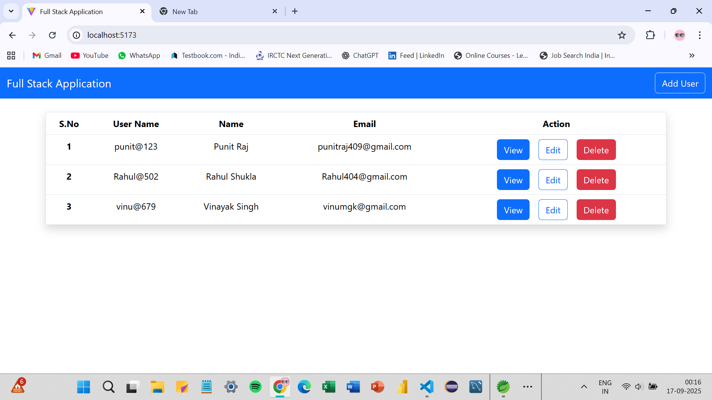
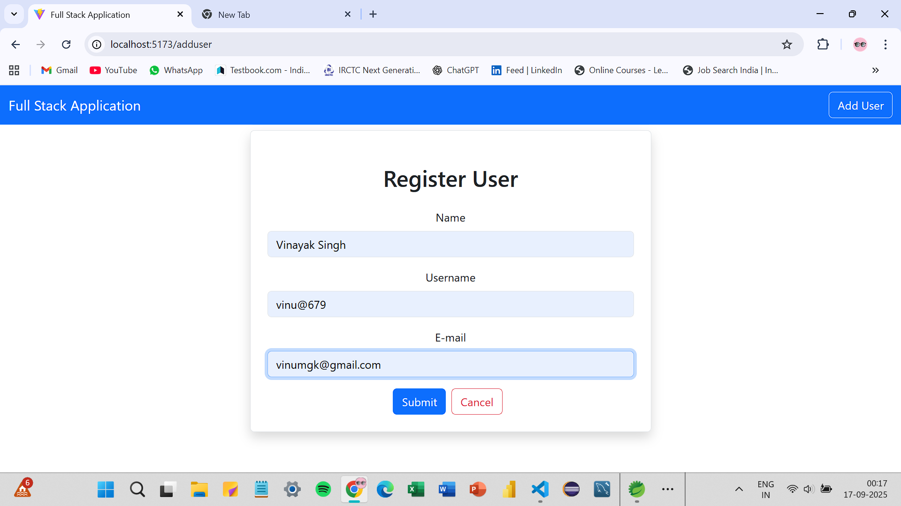
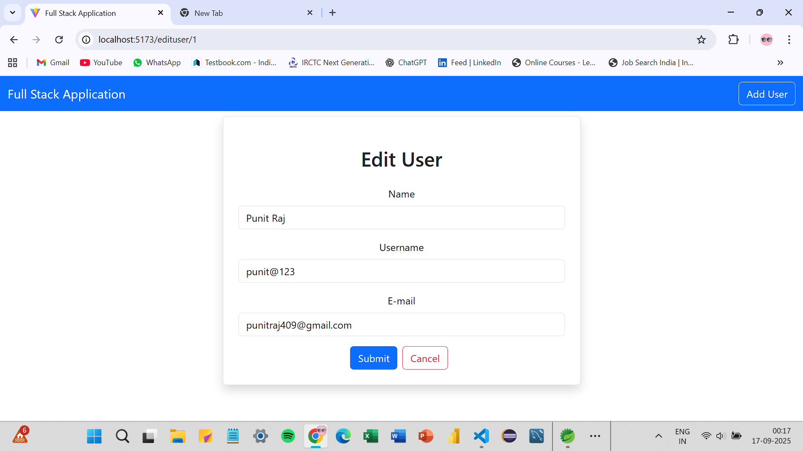

# User Management System

A **Spring Boot + React** full-stack web application that allows users to perform **Create, Read, Update, and Delete (CRUD)** operations.  
This project demonstrates **REST API development**, **React front-end integration**, and **MySQL database connectivity** 

## Backend
- Java 17
- Spring Boot 3.x
- Spring Data JPA
- Hibernate
- MySQL Database
- Maven

## Frontend
- React 18
- Axios (for API calls)
- React Router (for navigation)

## Project Structure
User Management System/
├── README.md
├── assets/
│   ├── home.png
│   ├── add.png
│   └── update.png
├── .gitignore
├── Backend/ 
│ ├── .env.example 
│ ├── src/main/java
│ ├── src/main/resources/application.properties
│ └── pom.xml
└── Frontend/
├── public/
├── src/
└── package.json

## Screenshots

| Home Page | Register User | Update User |
|----------|--------------|----------------|
|  |  |  |

## Configure Environment Variables before running

### 1. Navigate to the Backend folder & Copy the .env.example file to .env:
cd Backend

cp .env.example .env

### 2. Open .env and set your MySQL username and password:
DB_USERNAME=your_mysql_username

DB_PASSWORD=your_mysql_password

### 3. Run the backend:
mvn spring-boot:run

